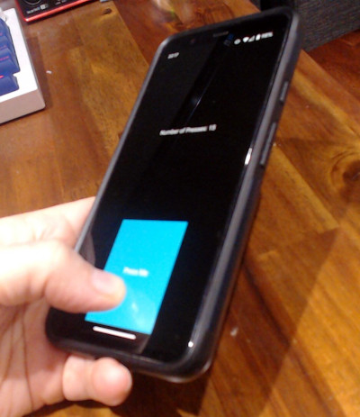

# A Simple Android Application



This project acts as a personal template for developing cross-platform
applications that work simultaneously in Windows/OSx/Linux desktop 
environments, as well as mobile operating systems.

The project focuses on generating Android .apks, however simply running 
```main.py``` is enough to launch it on the desktop.

[Project Developer Guide](docs/developer_guide.md)


# Running on Linux

1) Give yourself permission to access the serial port
   - Check to see if you are part of the "dialout" group
     ```commandline
     groups ${USER}
     ```
   - Add yourself to the "dialout group if you are not in it
     (Note: I had to reboot for this to take effect)
     ```commandline
     sudo newgrp dialout
     sudo gpasswd --add ${USER} dialout
     ```

2) Run the application from the poetry environment 
   ```commandline
   .venv/bin/python src/mirp/main.py 
   ```